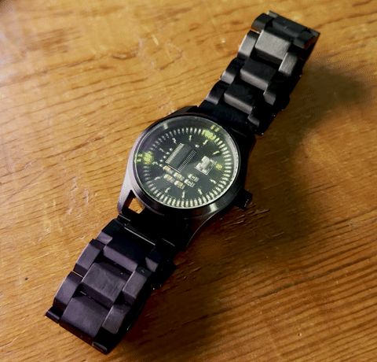
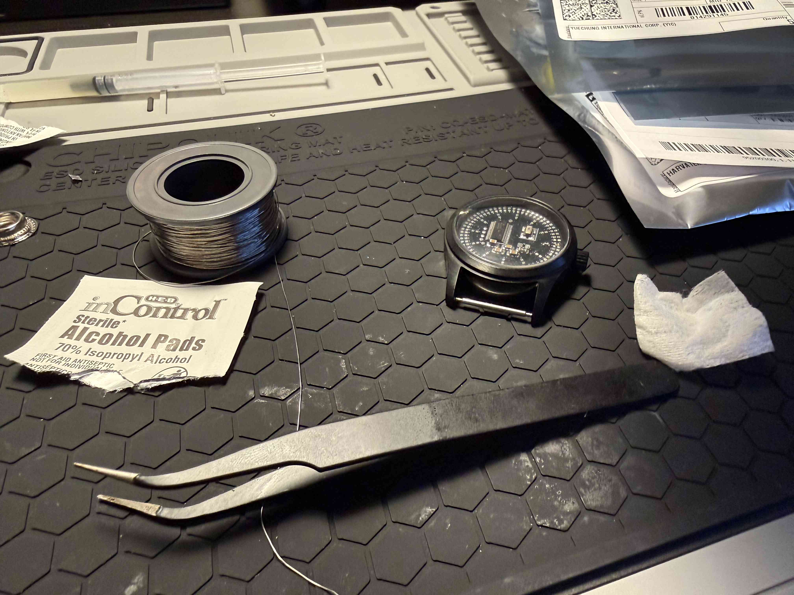
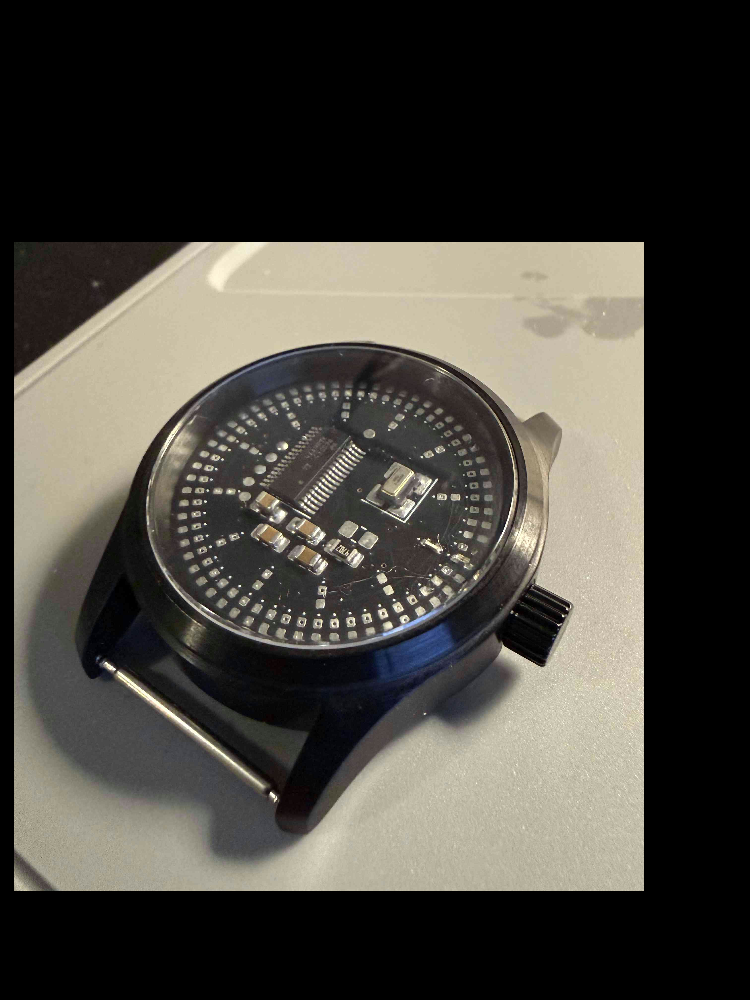
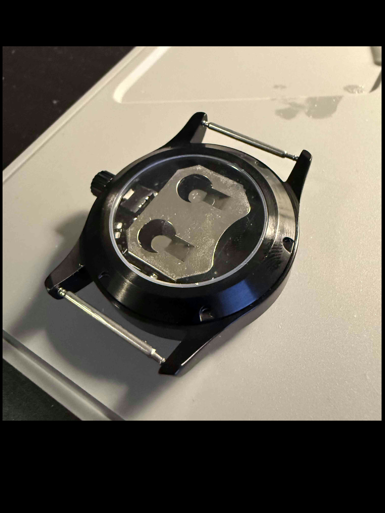
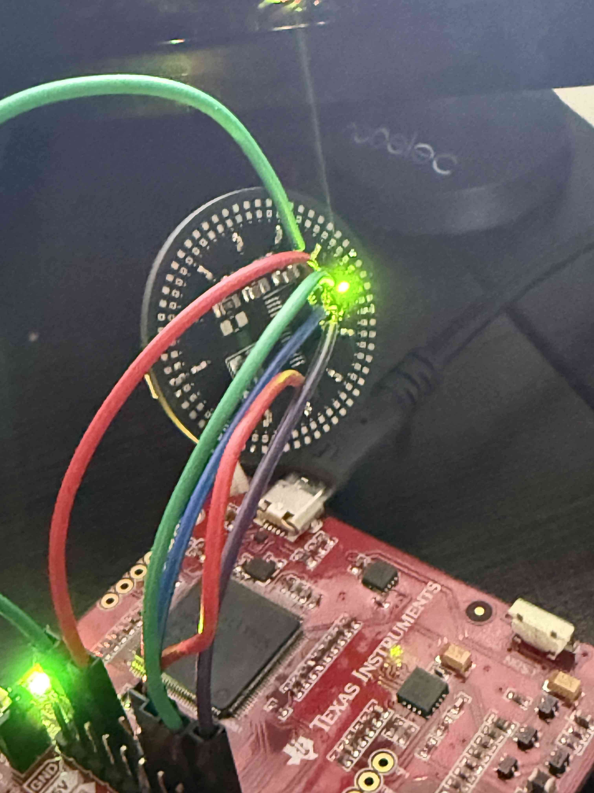
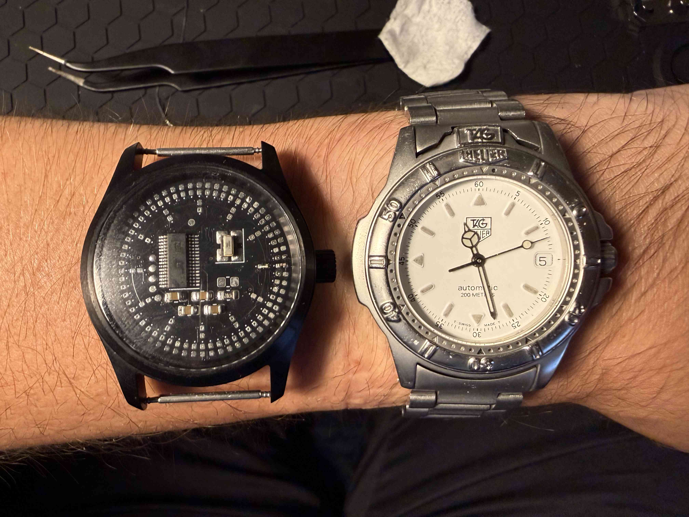
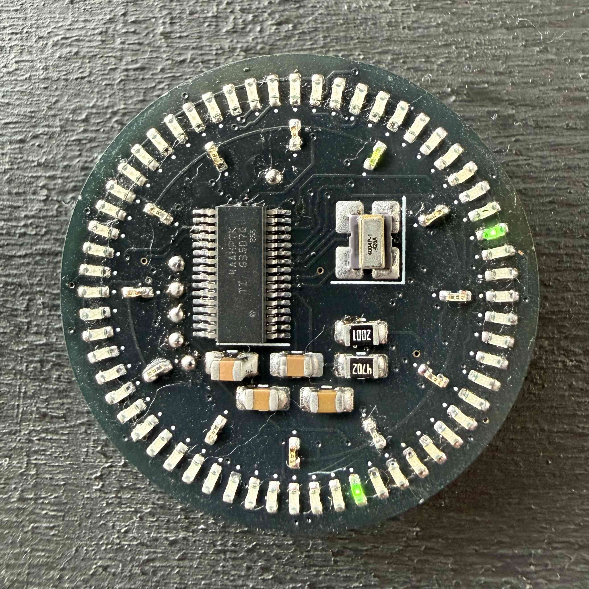
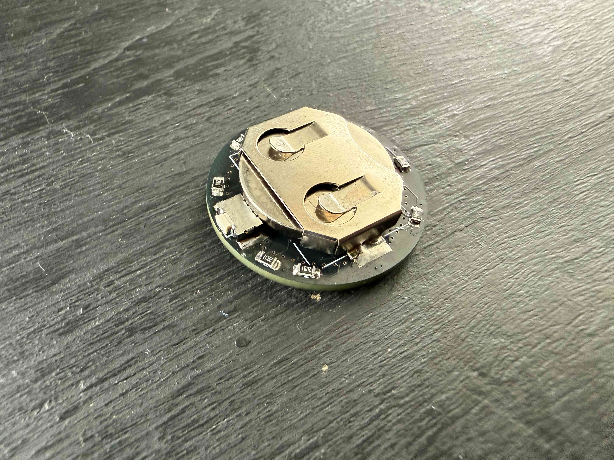

# LED Watch

This is a design for a digital LED watch that fits in a standard watch case. The watch shows the hours on the inner ring of 12 LEDs, and shows the minutes and seconds simultaneously on the outer ring of 60 LEDs. Time is adjustable through a switch in the crown that can be accessed with a paperclip.

## Electronics
A TI MSPM0 microcontroller controls a charlieplexed LED matrix of all 72 LEDs with 9 GPIO pins. Charlieplexing was chosen as it would otherwise take 17 GPIO pins to control the matrix with the more traditional wiring method. Timing is done via an external TCXO to minimize drift.

I chose the MSPM0 because I already had the development kit, and I was familiar with the device. With a project this simple, the MSPM0's low power consumption, minimal external component requirements, and integrated voltage regulator made it an adequate choice. In a future revision I could even opt for one of its smaller packages.

As for the LEDs, they are all 0402 packages with the inner ones being a yellow-green and the outer ones being a more solid green. In hindsight I would have opted for the green LEDs for everything because they have better diffusion and brightness and their package was much easier to solder. I knew when assembling that choosing the right current limiting resistors to set the maximum brightness was going to be trial and error, but I was surprised at just how much resistance I was able to put on the GPIO pins while keeping the LEDs more than bright enough for a well lit room. Each GPIO pin has 2kΩ on it, meaning the LEDs see 4kΩ each. With a 2.0V drop this means the maximum current through any given LED is about (3.3-2.0)/4000 = 300uA. Since the way the software is written means exactly one LED is on at all times, 300uA is the entire contribution of system current from the LEDs.

Powering this device required careful thought. I wanted to optimize for runtime given the space constraints, and it was hard to beat a coin-cell for this purpose. I chose the CR2032 both because it and it's holder fit nicely on the back of the PCB as well as their wide availability. The CR2450 was a tempting alternative, but I opted for the lower capacity (and smaller) CR2032 because of how easy they are to find. Initially, I thought a voltage regulator was necessary for this project which would have hurt battery life and required more components to be packed onto the PCB. Luckily, the MSPM0 has a wide input voltage range of 1.62 to 3.6V, making the CR2032 suitable to power the device throughout its entire lifespan (CR2032 batteries start at about 3.0V and die at about 1.8V).

## Physical Design
The 29.6mm PCB diameter was chosen to fit in a standard watch case. The watch case I used for this project claimed to fit a 28.5 to 29.2mm watch dial. Other research indicated that 29.5mm was the typical maximum dial size for the movement designed to fit in this case. The 29.6mm diameter allowed me to slowly sand away the edge of the PCB until the fit in the case was perfectly snug. The final diameter after sanding ended up being about 29.3mm. I was also careful to leave myself some space to sand by not routing traces near the board edge.

I chose a low-profile momentary switch on the back of the board to serve as an input for setting the time. This switch aligns well with the crown, making it accessible even when the watch is fully assembled. A challenge I would like to tackle in a future revision is attaching the crown to the switch so that it remains attached to the watch at all times and serves as a button itself. As of now, the crown completely unscrews from the watch making it easy to lose.

6 pads are exposed for the signals required to program the microcontroller. This programming method works, but in a future revision it would be nice to find a small connector so I don't have to solder wires to the board every time I think of a way to improve the firmware.

## Firmware
The firmware for the watch is minimal. The TCXO causes an interrupt every 32kHz. On every interrupt a master 15-bit (32768 possible values) counter is incremented. Every time the counter rolls over, the seconds LED updates as well as the minutes and hours if necessary. Between rollovers, the master counter serves as a way to define which of the three LEDs is on in the matrix. Charlieplexing relies on persistence of vision because only one LED can be on at one time. To do this, I look at the lower 7 bits (128 values) of the counter and whether those lower bits are in one of three ranges dictates which of the three possible LEDs is on (in fact, to compensate for my hour LEDs being dimmer, I give them more on-time by making their share of these 128 values larger than the minute/second LEDs). I choose 7 bits because choosing a larger number slows down the switching between the three LEDs enough to make flickering visible on my phone camera. On a 32kHz clock, to cycle through all 128 values takes about 3.9ms. A camera recording at 120 FPS captures a frame every 8.3ms. Becuase our period is less than the camera's, we avoid the flicker by guaranteeing all three LEDs are on at some point during each frame's exposure.

The only other part of the firmware is input management. The crown button allows the user to set the time. Pressing the button for less than a second will increment the hour, minute, or second. Pressing the button for more than a second will cycle between setting the hour, minute, or second.

When the microcontroller is not processing interrupts related to either keeping the time or setting the time, it is in standby mode to minimize power consumption.

## Images

KiCad 3D Model

Partially assembled. Getting the inner LEDs down was tricky as unlike the package for the outer ones, the pads are only exposed on the bottom and not on the sides.

Paritally assembled for a test fit in the case. I was surprise at how well it fit first try. The components had ample clearance between them and the glass. The PCB rests on a lip that provides this spacing.

Back of the case where the battery holder and switch can be seen. Getting a watch case with a clear back was definitely the correct decision :-)

Programming with an MSPM0 development board. These wires are pretty annoying, but they work!

Size comparison with my watch.

Fully assembled. It's 1:12:27!

Fully assembled (back). Battery installed.

## Videos
Videos with the watch fully working are in the img/ directory. GitHub does not currently support embedding videos over 10MB in readmes.